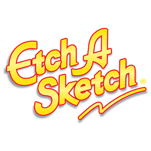

what i did in this project
- created a dynamic grid based off of default value or users value 1-70
- create each square with dom that lsiten for hovers, once user has hovered over square it turns it black.
- the squares are listening for the reset event listener, adding a css animation classname and changing the color to white.
- The Grid is generated by taking default value or users value and creating that number of squares inside a row, and that many rows inside of the grid.
- Allow users to change the size from 1-70, the program runs when a user inputs a new Grid Size, and makes it the same way.

design:
- went for classic etcha sketch look
- for the fonts i found *this font* looked the most similar to the original etcha sketch. and *this font* for the Magic Screen sub text
- added a slight shimmer in CSS for the title logo, to try to give it more of an metalic look
- Screen shakes when picture is reset, and the black squares fade to white. trying to mimick the feel of a etcha sketch.
- this was done by using classes to add animations to each part of the website
- The dials twist when you adjust settings as well being done with CSS and javascript to add and remove the classnames

<!-- PROJECT LOGO -->
 

<h1 align="center">Etch-A-Sketch</h1>

  

    A Web created Etcha Sketch
     
    <a href="https://linktowebsite.com">View Live Demo</a>

<!-- TABLE OF CONTENTS -->

  
Table of Contents

  <ol>
    <li>
      <a href="#about-the-project">About The Project</a>
      <ul>
        <li><a href="#built-with">Built With</a></li>
      </ul>
    </li>
    <li>
      <a href="#getting-started">Getting Started</a>
      <ul>
        <li><a href="#prerequisites">Prerequisites</a></li>
        <li><a href="#installation">Installation</a></li>
      </ul>
    </li>
    <li><a href="#usage">Usage</a></li>
    <li><a href="#roadmap">Roadmap</a></li>
    <li><a href="#contributing">Contributing</a></li>
    <li><a href="#license">License</a></li>
    <li><a href="#contact">Contact</a></li>
    <li><a href="#acknowledgments">Acknowledgments</a></li>
  </ol>

<!-- ABOUT THE PROJECT -->
## About The Project

Here's a blank template to get started: this is wherre you should be explaining what ur project does

### Built With
 - Vanilla javaScript
 - CSS & HTML

<!-- USAGE EXAMPLES -->
## Usage

Use this space to show useful examples of how a project can be used. Additional screenshots, code examples and demos work well in this space. You may also link to more resources.

_For more examples, please refer to the [Documentation](https://example.com)

<!-- CONTACT -->
## Contact

**John Farina** - johnfarina8@gmail.com

Project Link: [github.com/john-farina/Zoltar](https://github.com/john-farina/Zoltar)

(<a href="#readme-top">back to top</a>)

