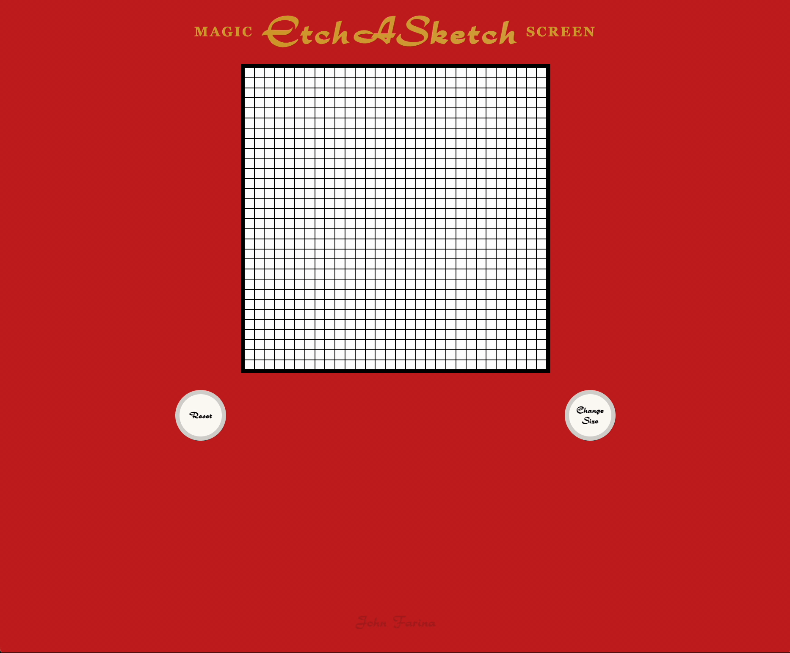
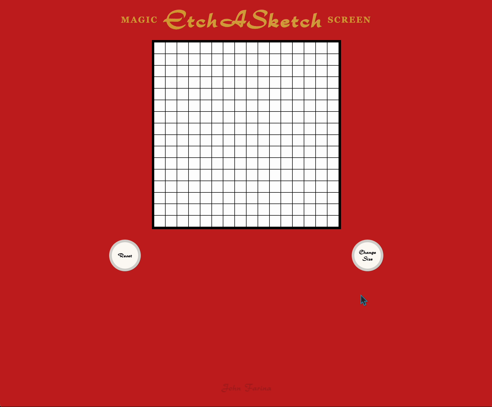
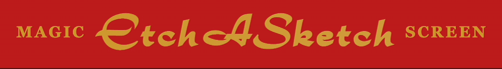

<!-- PROJECT LOGO -->

<h1 align="center">Etch-A-Sketch</h1>

  

    A Web created Etcha Sketch
     
    <a href="https://etchasketch.johnfarina.co">View Live Demo</a>

<!-- TABLE OF CONTENTS -->

  
Table of Contents

  <ol>
    <li>
      <a href="#about-the-project">About The Project</a>
      <ul>
        <li><a href="#built-with">Built With</a></li>
      </ul>
    </li>
    <li>
      <a href="#javascript">JavaScript</a>
      <ul>
        <li><a href="#grid-creation">Grid Creation</a></li>
        <li><a href="#adding-class-names-for-animation">Adding Class Names for Animation</a></li>
      </ul>
    </li>
   <li>
      <a href="#design">Design</a>
      <ul>
        <li><a href="#title">Title</a></li>
        <li><a href="#grid">Grid</a></li>
        <li><a href="#dials">Dials</a></li>
      </ul>
    </li>
            <li><a href="#usage">Usage</a></li>
    <li><a href="#contact">Contact</a></li>
  </ol>

<!-- ABOUT THE PROJECT -->
## About The Project

This project was created with the intention to recreate the feel of using an actual Etcha Sketch as much as I can on a website. I used Vanilla JS because there was no purpose for a library.

### Built With
 - JavaScript
 - CSS & HTML

## JavaScript

### **Grid Creation**

For the grid I am dynamically creating the amount of Boxes and Rows, for the default value of Size or the users input from a range of 1-70. Each square in Rows are created by DOM and have its own event listener added when returned. Which listens for `mousehover`, `mouseon`, etc. and converts the background color to black.  
Each grid is created on run and can be dynamically changed by user input. To generate a new one.

### **Adding Class Names for Animations**

For animations, I am adding and removing class names that are associated with CSS animations. After I add them I set a timeout for the specified length of that animation to then remove the class names. Clearing it for the next animation.

(<a href="#readme-top">back to top</a>)

## Design

### **Title**

With the title I wanted to get as close as possible to the actual Etch A Sketch font, after searching I found one similar and I used:

- **Rondo** *(for the main text)*
- **Fortrack Regular** *(for the sub text)*

Because the Etch A Sketch's title is usually a metallic color, I used a long gradient under the image which moves left to right. Mimicking a shimmer of metal to the light.

### **Grid**

The grid is styled by the squares inside, which is being styled with a solid border, and equal height and width  
The Fading animation of your drawing is made by creating a CSS animation which fades background color from black to white

### **Dials**

The dials are created just by a simple circle with a solid gray border, and it rotates as you click it with transforms rotate in a CSS animation.

(<a href="#readme-top">back to top</a>)

<!-- USAGE EXAMPLES -->
## Usage

Draw with your mouse on the grid, and reset to shake it away. No saving just like classic Etch A Sketch!

<!-- CONTACT -->
## Contact

**John Farina** - johnfarina8@gmail.com

My Website: [johnfarina.co](https://johnfarina.co)

Project Link: [github.com/john-farina/etchaSketch](https://github.com/john-farina/etchaSketch)

(<a href="#readme-top">back to top</a>)

